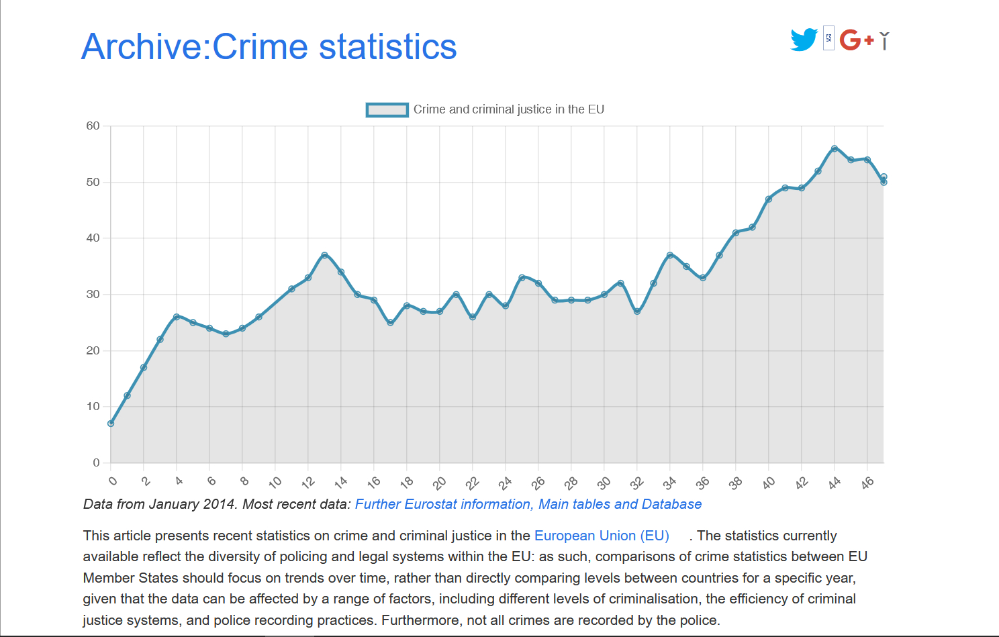
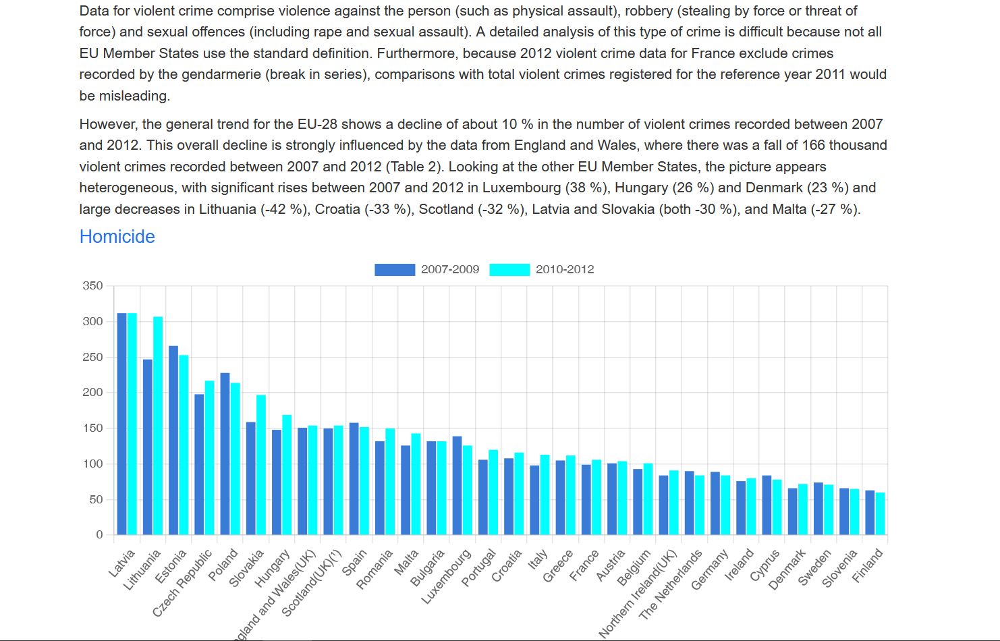

<h1>DATA VISUALIZATION CHALLENGE</h1>  
 
  
  

---      
  
Here's to a **great collaboration** for this exercise, with the blissful pairing of [Anthony Lambert](https://github.com/Kaleidosport) and [Sara Laloux](https://github.com/saralaloux)! 🥂  

## Learning objectives

This consolidation challenge will help you assess your ability to solve a problem inspired from real-life situation using your new javascript muscles involving the following know-hows:  
  
- [x] DOM manipulation.
- [x] AJAX/FETCH request.
- [x] Using Third-party libraries.
- [x] Problem-solving : design a logical solution to implement the expected result.
- [x] Debugging using the console.
- [x] Understand the notion of "Separation of concerns".   
  
## Work distribution 
  
While you can access our end product on its [GitHub page](https://saralaloux.github.io/js-datavisualisation-challenge/), keep in mind we built it with Chart.js.  
  
<table>
    <tr>
        <th colspan="2">Sara</th>
        <th colspan="2">Anthony</th>
        <th colspan="1">Both</th>
    </tr>
    <tr>
        <td>Homicides chart</td>
        <td>Readme & GitHub repo management</td>
        <td>Creating canvas areas</td>
        <td>Datapoints chart</td>
        <td>Crimes chart</td>
    </tr>
</table>  
  
---  

## Prime teamwork through and through    
> A flawless ride 🎉    

      